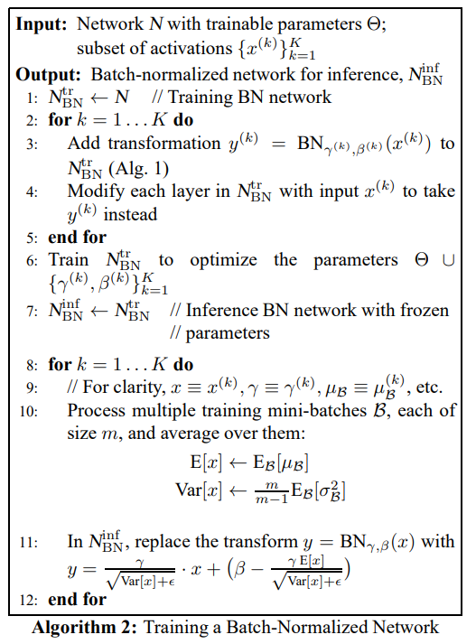

이번 포스트에서는 지금는 너무나 당연시 사용되고 있는 Batch Normalization(배치 정규화, BN)에 대해 정리하고자 합니다.

BN은 다양한 매커니즘에서 사용되고 있으며 일반적인 신경망이나 Transformer 등에서도 사용되고 있습니다.

일단 간단하게 BN의 특징을 간단히 정리하면 다음과 같습니다.

> ### Batch Normalization의 특징
> 네트워크 input 시에만 정규화하는 것이 아니라, 레이어별로 입력값을 정규화를 진행함.
> 이때, 미니배치별 통계량(평균, 분산)을 사용해서 정규화 한다.
> 예상되는 효과는 다음과 같다.
> - 학습이 안정된다.
> - 파라미터의 값이나 초기값의 영향이 작아진다. 이를 통해, 높은 학습률을 설정할 수 있어, 학습의 속도가 빨라진다.
> - 드롭아웃의 필요성을 줄일 수 있다.

## 해결하고싶은 문제: Internal Covariate Shift

일단, BN이 해결하고 싶은 문제부터 설명하고자 한다.

예를들어, 아래의 그림같이 학습데이터와 테스트데이터의 분포가 다른 경우가 종종 있다.

이 경우, 학습데이터에서 많이 보이는 특징의 영역에 대해서는 학습한 모델이 테스트 데이터에서도 잘 작동할 가능성이 높지만, 학습데이터에서 별로 볼 수 없었던 특징을 많이 가진 테스트 데이터에 많다면 모델은 잘 작동하지 않을 것이다.

이것을 Covariate Shift라고 부르며, 이 Covariate Shift를 해결하는것을 Domain Adaptation이라고 한다.

딥러닝에서는 여러 레이어를 깊게 쌓아 올린다. 

각 레이어는 학습하면서 가중치가 지속적으로 조정된다. 이런 가중치 변화가 일어나면, 그 레이어의 출력 분포도 변화하게 된다.

예를 들어, 첫 번째 레이어가 학습으로 인해 파라미터가 변하면, 그 레이어의 출력이 변하고, 이 출력이 다음 레이어의 입력으로 들어가게 된다. 이렇게 되면 다음 레이어는 이전 레이어의 변화된 출력을 새로운 입력으로 받아야 하므로, 그 입력 분포가 계속 바뀌게 된다.

이것을 Internal Covariate Shift라고 부른다.

직관적으로 레이어에 들어오는 입력 분포가 계속 변하면 학습이 안정적이지 않을 것이다.

Batch Normalization은 해당 문제를 해결하려는 기법이다.

## Batch Normalization

기계학습에서는 입력 데이터를 각 특징별로 Normalization하는 경우가 많다.

scikit-learn의 StandardScaler등을 사용해서 말이다.

이 과정을 통해, 각 데이터의 평균을 0, 표준편차를 1로 맞춰 데이터 분포의 치우침이나 스케일에 대한 영향을 제거해준다.

딥러닝에서는 레이어가 수십 수백개 쌓여있는 구조이므로, 이전 장에서 살펴보았듯이, 각 레이어의 가중치가 변할 때마다 미니배치마다 각 레이어의 입력 분포가 변하는 문제가 발생한다(Internal Covariate Shift).

그래서 초기 입력 데이터만 정규화 하는 것이 아니라, 각 레이어의 입력도 정규화 하자는 발상이 나오게 되었다.

따라서, 정확하게 하려면 매번 가중치를 업데이트 할 떄마다 학습 데이터 전체를 네트워크에 통과시켜 각 레이어의 입력을 구하고, 그 평균과 분산을 통해 정규화 해야한다.

그러나 이런 방식은 효율성이 떨어지기 때문에, Batch Normalization에서는 전체 학습데이터가 아닌 미니매치바다 통계값을 계산하여 미니배치 단위로 정규화를 수행하도록 한다.

나중에 설명하겠지만, 이러한 방법은 Drop Out같은 Regularization의 효과도 얻을 수 있었다.

## Batch Normalization 알고리즘
구체적으로 어떻게 정규화가 이루어지는지 논문의 알고리즘을 살표보자.

### 1. 미니배치의 평균과 분산을 계산

$$ \mu_{\mathcal{B}} = \frac{1}{m} \sum_{i=1}^{m} x_i $$

$$ \sigma^2_{\mathcal{B}} = \frac{1}{m} \sum_{i=1}^{m} (x_i - \mu_{\mathcal{B}})^2 $$

먼저, 미니배치의 평균과 분산을 구합니다. 

i는 미니배치의 데이터 index입니다.

즉 레이어별, 각 채널별로 평균과 분산을 계산합니다.

엄밀히 말하면, 레이어와 채널 차원을 나타내는 첨자가 필요하지만, 여기서는 이를 생략하고 있습니다.

### 2. 정규화

$$ \hat{x}_i = \frac{x_i - \mu_{\mathcal{B}}}{\sqrt{\sigma^2_{\mathcal{B}} + \epsilon}} $$

그 후, 위의 식으로 정규화를 합니다.

일반적인 정규화와 달리 분모를 보면 루트안에 $\epsilon$을 더해주는데, 이것은 분모가 0이 되는것을 방지하기 위해서입니다.

### 3. 스케일링과 시프팅

정규화된 $\hat{x}_{i}$를 그대로 사용해도 되지만, 이렇게 하면 다음 레이어에서 비선형성이 감소하여 모델의 표현력이 떨어질 수 있습니다.

이는 정규화를 통해 출력이 일정한 분포(평균 0, 분산 1)로 제한되기 때문입니다.

예를 들어, 시그모이드 함수는 0 근처에서는 거의 선형에 가깝지만, 절댓값이 커질수록 비선형성이 강해집니다. 우리는 이러한 비선형성을 도입하기 위해 시그모이드 함수를 사용하는데, 레이어마다 정규화를 적용하면 학습을 통해 얻은 비선형성이 사라질 위험이 있습니다.

$$ y_i = \gamma \hat{x}_{i} + \beta $$

Batch Normalization에서는 이 문제를 해결하기 위해 정규화된 $\hat{x}_{i}$에 대해 위와 같이 스케일링(배율)과 시프팅(이동) 파라미터를 추가합니다.

이 추가 파라미터 $\gamma$와 $\beta$ 덕분에 정규화 후에도 입력의 분포를 학습에 맞게 조절할 수 있으며, 비선형성을 유지하면서도 각 레이어가 충분한 표현력을 갖도록 할 수 있습니다.

시그모이드 함수에서 스케일링과 시프팅의 전과 후를 생각해 보자.

정규화된 $\hat{x}_{i}$를 입력으로 하면 시그모이드 함수의 범위는 위의 사진과 같을 것이다. 시그모이드 함수는 0 근처에서는 거의 선형에 가까우므로 비선형성을 잃게 된다.
 

적절하게 스케일링과 시프팅을 한 후 시그모이드 함수에 입력한 결과는 위와 같다. 비선형성을 잃지 않는다.

## 전체 알고리즘

지금까지는 미니배치를 사용해서 정규화 하는 방법에 대해서 알아보았다.

지금부터는, Batch Normalization을 사용해 어떻게 데이터를 학습하고 추론하는지 알아보려고 한다.

전체 알고리즘은 다음과 같다.

### 학습할때

오렌지 박스 부분이 Batch Normalization을 적용한 학습 방법이다.

N은 네트워크 전체를 나타냅니다.
- 2~5행: 배치 정규화를 수행합니다.
- 3행: 각 채널별로 x(k)를 정규화하여 y(k)로 변화한다. 여기서 k는 몇번째 채널인지를 나타낸다.
- 4행: 각 레이어에서 입력을 x(k)에서 y(k)로 대체한다.
- 6행: 손실 함수를 통해 신경망 파라미터 Θ와 Batch Normaliation의 파라미터 β(k)와 γ(k)를 업데이트한다.
- 7행: 최종적으로 얻은 네트워크 $N_{BN}^{tr}$을 추론용 네트워크로 사용한다.

일반적인 신경망 학습 방식과 크게 다르지 않다.

### 추론할때

학습한 모델을 사용해 추론할때는, 학습한 파라미터들 Θ, β(k), γ(k)를 고정합니다.

여기서 문제가 발생합니다.

학습시에는 미니배치 단위로 평균과 분산을 구해 정규화를 했습니다.
하지만 추론단계에서는 이와 같은 방식으로, 추론하고자 하는 샘플마다 구한 평균과 분산을 사용하는 것은 적절하지 않다.

왜냐하면, 예를 들어 샘플이 하나뿐이라면 평균과 분산을 계산할 수 없으며, 여러 샘플을 모아 계산하더라도 샘플을 어떻게 선택하느냐에 따라 평균과 분산이 달라져 추론 결과가 달라질 수 있기 때문이다. 추론 단계에서는 결과의 일관성이 매우 중요한데, 추론하려는 데이터를 구성하는 방식에 따라 추론 결과가 변할 수 있다는 뜻이다.

이 문제를 해결하기 위해 Batch Normalization에서는 학습 중에 이동평균(Running Mean)과 이동분산(Running Variance)을 사용한다. 

전체 알고리즘에서 위의 그림과 같이 주황색 박스 부분이다.

$$ \mathbb{E}[x] \leftarrow \eta \times \mathbb{E}[x] + (1 - \eta) \times \mu_{\mathcal{B}} $$

$$ \text{Var}[x] \leftarrow \eta \times \text{Var}[x] + (1 - \eta) \times \sigma^2_{\mathcal{B}} $$

위의 수식과 같이 학습 과정에서 배치마다 계산된 평균과 분산을 이동평균으로 누적하여 기록해둔다.

$$ y = \gamma \cdot \hat{x} + \beta \\
= \gamma \frac{x - \mathbb{E}[x]}{\sqrt{\text{Var}[x] + \epsilon}} + \beta \\
= \frac{\gamma}{\sqrt{\text{Var}[x] + \epsilon}} \cdot x + \left( \beta - \frac{\gamma \mathbb{E}[x]}{\sqrt{\text{Var}[x] + \epsilon}} \right) $$

그리고 학습 시에 계산된 평균과 분산, 스케일링 파라미터 𝛽, 𝛾를 사용하여, 위의 식으로 최종 추론을 수행합니다.

## Batch Normalization 적용 시점

$$ z=g(Wx+b) $$

레이어의 출력값은 입력값 x에 대해서, 가중치 w를 곱하고 바이어스 b를 더하고 그 후 활성화함수 g를 통해 정의 할 수 있다.

여기서 어느 시점에 Batch Normalization을 적용해야 할까?

1. 이전 레이어의 출력값 x에 적용
2. 활성화함수 이전에 적용. 즉, Wx+b에 적용.

논문에서는 후자인 활성화함수 이전에 적용하는것을 권장하고 있다.

즉, 

$$ z=g(BN(Wx)) $$

위의 수식과 같다.

## References
- https://data-analytics.fun/2021/09/11/understanding-batch-normalization/#Batch_Normalization
- https://arxiv.org/abs/1502.03167