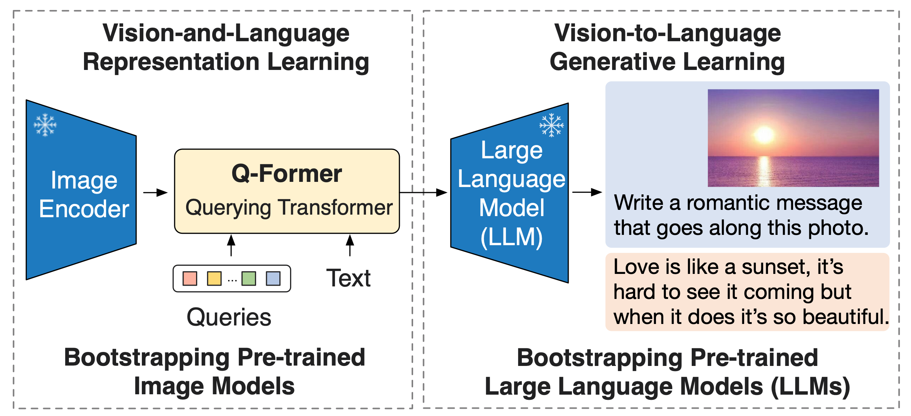
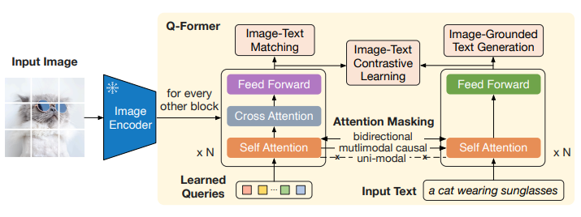
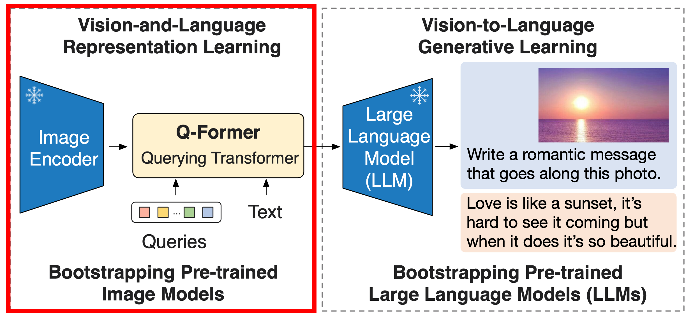
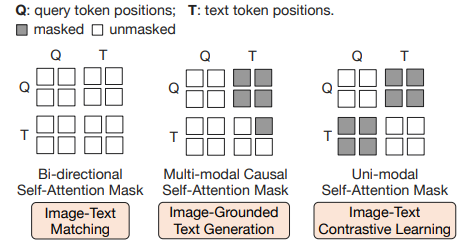
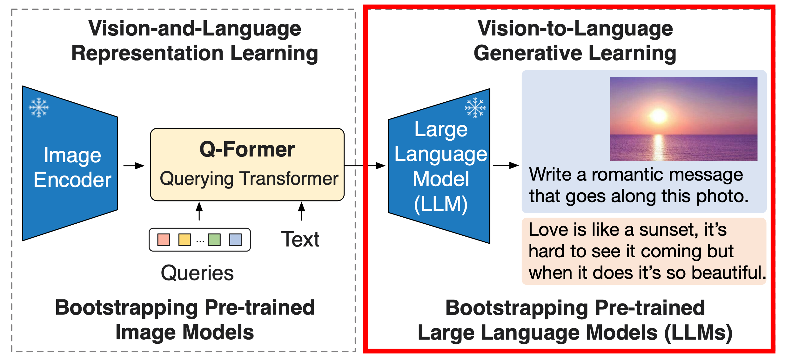
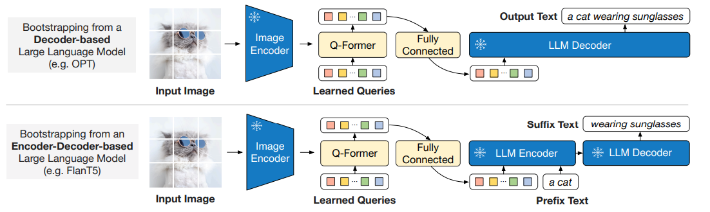
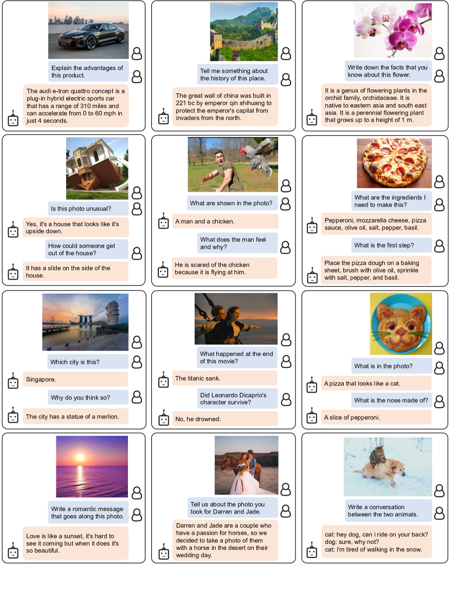
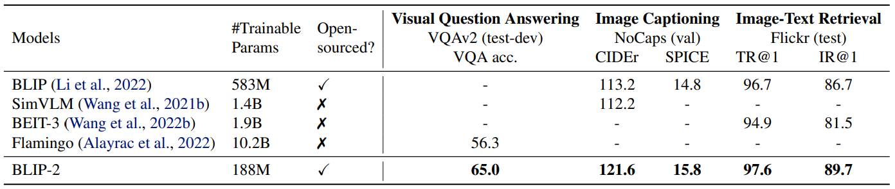
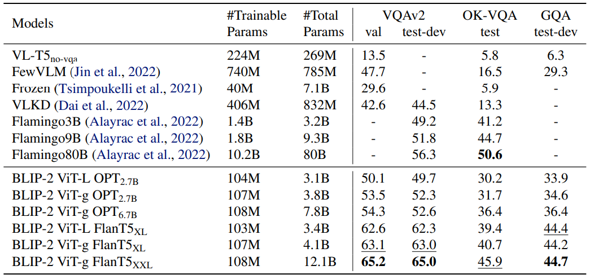

오늘은 BLIP-2 연구에 대해 정리하고자 한다.

먼저 BLIP-2 연구가 나오게 된 배경부터 차근차근 알아가보자.

*Info box의 내용은 대부분 ChatGPT의 답변 내용을 정리한 것이다.

## 문제점: VLP의 효율성
Vision-language pre-training (VLP)연구는 최근 수 년 사이에 주목할만한 결과를 보여주었다.

그러나, 대부분의 SOTA vision-language model은 거대한 모델구조와 수없이 많은 데이터셋 사용으로 인해 모델을 pre-training을 하는데 아주 높은 computation cost를 요구한다. 
더욱이, LLM 같은 unimodal pre-trained model를 활용할 수 없어 구조적으로 유연성이 떨어진다.

기존에 frozen 비전모델과 언어모델을 사용해서 VLP를 달성한 연구들이 있었으나(e.g. Frozen (Tsimpoukelli et al., 2021), Flamingo (Alayracet al., 2022)), modality gap을 매꾸기에 충분하지 않았다.

BLIP-2에서는 해당 문제를 해결하고자 pre-trained 비전 모델과 언어모델을 부투스트래핑하여 범용적이고 효율적인 VLP 방법을 제안한다.

## Bootstrap

> **Bootstrap**
>
> "Bootstrap"은 일반적으로 기존 자원을 활용하여 시스템을 초기화하거나 성능을 개선하는 방법을 의미합니다.
> 기계 학습이나 컴퓨터 과학에서는 다음과 같은 의미로 사용됩니다:
> 1. **기존 자원을 활용한 초기화 또는 개선**: 새로운 자원이나 데이터를 추가하지 않고, 이미 존재하는 모델, 데이터, 자원 등을 활용해 성능을 개선하거나 초기 단계 작업을 수행하는 방식입니다.
> 2. **기본 모델 또는 기법을 기반으로 확장**: 사전 학습된 모델이나 기존 기술을 기반으로, 새로운 목적에 맞게 학습하거나 확장하여 성능을 높이는 방식입니다.
{: .prompt-info }

BLIP-2 논문에서는 비전모델과 언어모델을 VLP를 위해 처음부터 학습하지 않고, 기존에 널리 알려진 사전학습된 비전모델과 언어모델을 frozen 상태로 활용해서 VLP를 달성하는 방법을 가지고 있다.

이를 Bootstrap이라고 논문은 표현하고 있다.

## BLIP-2

효율적인 시각-언어 정렬을 위해, 고정된(frozen) 유니모달 모델들과 함께 사용할 수 있는 Querying Transformer (Q-Former)를 제안했다.

Q-Former는 두단계로 구성된 학습 전략을 통해 사전학습된다.

1-stage: 시각-언어 표현(representatino) 학습을 수행하여 Q-Former가 텍스트와 관련성 있는 시각 표현을 학습하도록 한다.

2-stage: 시각-언어 생성학습을 수행하여, Q-Former의 출력을 고정된 LLM에 연결하고 Q-Former가 생성한 시각적 표현이 LLM에서 해석될 수 있도록 학습한다.

이 VLP 프레임워크를 BLIP-2 (Bootstrapping Language-Image Pre-training) 라고 이름지었다.

### Querying Transformer (Q-Former)

Q-Former는 동일한 self-attention layer를 공유하는 두 트랜스포머로 구성된다.

1. 고정된 이미지 인코더와 상호작용하여 시각적 특징을 추출하는 이미지 트랜스포머
2. 텍스트 인코더 및 텍스트 디코더 역할을 모두 수행할 수 있는 텍스트 트랜스포머

이미지 트랜스포머의 입력으로 사용할 고정된 수의 학습 가능한 쿼리 임베딩을 사용한다. 이 쿼리들은 self-attention을 통해 서로 상호작용하며, cross-attention을 통해 고정된 이미지 특징과도 상호작용한다. 또한 쿼리는 동일한 self-attention 레이어를 통해 텍스트와도 상호작용할 수 있다.

실험에서는 각 쿼리가 768차원을 가지며, 32개의 쿼리를 사용한다. 

### Vision-Language Representation Learning

표현 학습 단계에서는 Q-Former를 고정된 이미지 인코더에 연결하고 이미지-텍스트 쌍을 사용해 사전학습을 한다. 이 과정에서 쿼리가 텍스트와 가장 관련성이 높은 시각적 표현을 추출하도록 Q-Former를 학습시키는 것을 목표로 한다.

BLIP(Li et al., 2022)에서 영감을 받아, 세 가지 사전 학습 목표를 가지고 학습을 진행한다. 
각 목표는 쿼리와 텍스트 간의 상호작용을 제어하기 위해 서로 다른 attention masking 전략을 사용한다.

#### Image-Text Contrastive Learning (ITC)
이미지 표현과 텍스트 표현(representation)을 서로 정렬시켜 상호 정보를 최대하화하는 학습 방식이다. 이미지-텍스트의 positive-pair와 negative-pair의 유사도를 비교하는 방식으로 이루어진다. 

구체적으로, 이미지 트랜스포머에서 얻은 쿼리 표현 Z와 텍스트 트랜스포머에서 얻은 텍스트 표현 t를 정렬한다.

Z는 쿼리개수만큼 출력 임베딩을 포함하고 있기때문에, 각 쿼리 출력 임베딩과 t간의 유사도를 계산한 후 가장 높은 값을 이미지-텍스트 유사도로 사용한다.

이미지 표현과 텍스트 표현이 서로의 정보를 학습 중에 직접 참조하지 못하도록 제한하기 위해, unimodal 
self-attention mask를 사용하였다.

> 만약 이미지와 텍스트가 서로를 직접 참조할 수 있게 되면, 이미지와 텍스트 표현이 단순히 양성 쌍의 일치를 학습하기보다는 서로의 정보에 지나치게 의존해 얕은 연관성을 학습할 가능성이 크다. 이로 인해 모델은 양성 쌍과 음성 쌍의 차이를 학습하지 못하고, 두 모달리티 간의 독립적인 의미 표현을 학습하지 않게 된다.
{: .prompt-info }

#### Image-grounded Text Generation (ITG)
Q-Former가 입력 이미지를 조건으로 텍스트를 생성하도록 학습시킨다. 

Q-Former 구조상 frozen 이미지 인코더와 텍스트 토큰 간의 직접 상호작용이 불가능하기 때문에, 쿼리들이 먼저 필요한 시각적 정보를 추출한 후 이를 self-attention를 통해 텍스트 토큰으로 전달된다. 따라서, 쿼리는 텍스트 생성에 필요한 모든 시각적 특징을 추출하도록 학습된다.

이를 위해 UniLM (Dong et al., 2019).과 유사한 멀티모달 causal self-attention mask를 사용해 쿼리-텍스트 상호작용을 조절한다. 쿼리는 서로를 참조할 수 있지만 텍스트 토큰을 참조할 수 없습니다. 각 텍스트 토큰은 모든 쿼리와 이전의 텍스트 토큰을 참조할 수 있다.

#### Image-Text Matching (ITM)
이미지와 텍스트 표현 간의 세밀한 정렬을 학습하는 것을 목표로 한다.

이미지-텍스트 쌍이 양성인지 음성인지 예측하는 이진 분류 작업을 수행한다.

여기서는 모든 쿼리와 텍스트가 서로 참조할 수 있도록 마스크를 사용하여, 출력 쿼리 임베딩 Z가 멀티모달 정보를 포착하도록 한다. 각 쿼리 임베딩을 이진 분류기로 입력하여 logit을 예측하고, 모든 쿼리에 대한 logit의 평균을 최종 점수로 사용한다.

### Vision-to-Language Generative Learning

LLM의 언어 생성 능력을 활용하기 위해 고정된 이미지 인코더를 포함한 Q-Former를 고정된 LLM에 연결한다.

FC layer를 사용해서 출력 쿼리 임베딩 Z를 LLM의 텍스트 임베딩과 같은 dimension으로 변환한다. 변환된 쿼리 임베딩은 LLM의 입력 텍스트 임베딩 앞에 배치되어, Q-Former가 추출한 시각적 표현을 기반으로 LLM의 출력을 조건화하는 soft visual prompt 역할을 한다.

Q-Former는 언어와 관련된 시각적 표현을 추출하도록 학습되었기 때문에, LLM에 유용한 정보만 제공하고 불필요한 시각적 정보를 제거하는 bottleneck 역할을 하도록 학습되었다. 이를 통해 LLM이 시각-언어 정렬을 학습해야하는 부담을 줄여주고 catastrophic forgetting problem을 완화한다.

> **Catastrophic Forgetting**
>
> Catastrophic Forgetting은 기계 학습, 특히 신경망에서 나타나는 문제로, 모델이 새로운 데이터를 학습하면서 이전에 학습한 정보를 잊어버리는 현상을 말합니다. 이 문제는 주로 순차적 학습 (또는 지속적 학습) 환경에서 발생하며, 예를 들어 모델이 한 작업을 학습한 후 새로운 작업을 학습할 때, 이전 작업에 대한 성능이 급격히 저하될 수 있습니다.
> 
> _BLIP-2에서는 Q-Former덕분에 LLM이 시각-언어 정렬 작업을 학습하지 않아도 되었고 따라서 catastrophic forgetting을 방지하였다._
{: .prompt-info }

## Experiment

이미지에 대한 여러 질문에 적절히 잘 답변한다.

Zero-shot vision-language task에서 기존의 모델보다 훨씬 작은 파라미터 개수로 더 좋은 성능을 보여주고 있다.

Zero-shot visual question answering 에서도 적은 파라미터로 좋은 성능을 보여주고 있다.

이외 Fine-Tuning, Image Captioning, Image-Text Retrieval 등 여러 task에서도 좋은 성능을 보여주었다.

## Limitation
1. 최신 LLM들은 몇개의 예시만으로도 in-context learning을 수행할 수 있지만, BLIP-2에서는 LLM에 VQA 예시를 제공해도 성능 개선이 관찰되지 않았다.

    - 이 이유에 대해, 저자들은 사전 학습 데이터셋에 각 샘플당 단일 이미지-텍스트 쌍만 포함되어 있어, LLM이 여러 이미지-텍스트 쌍간의 관계를 학습하지 못한 점으로 분석하고 있다.

2. BLIP-2의 이미지-텍스트 생성은 LLM의 부정확한 지식, 잘못한 추론 과정, 최신 이미지 콘텐츠에 대한 정보 부족 등의 이유로 인해 만족스럽지 않은 결과를 낼 수 있다.

3. 고정된 모델을 사용하기 때문에, BLIP-2는 LLM의 위험 요소도 함께 가지는데, 여기에는 공격적인 언어 생성, 사회적 편향, 개인 정보 노출 등이 포함 된다.

> **In-Context Learning**
>
> In-context learning은 모델이 사전 훈련 없이 제공된 예시(프롬프트)만으로 새로운 문제를 해결하는 방식입니다.
> 
> 예시) 
> 프롬프트:
"파리는 프랑스의 수도입니다."
"베를린은 독일의 수도입니다."
>
> 질문: 
"도쿄는 어느 나라의 수도인가요?"
→ 모델 답변: "도쿄는 일본의 수도입니다."
{: .prompt-info }